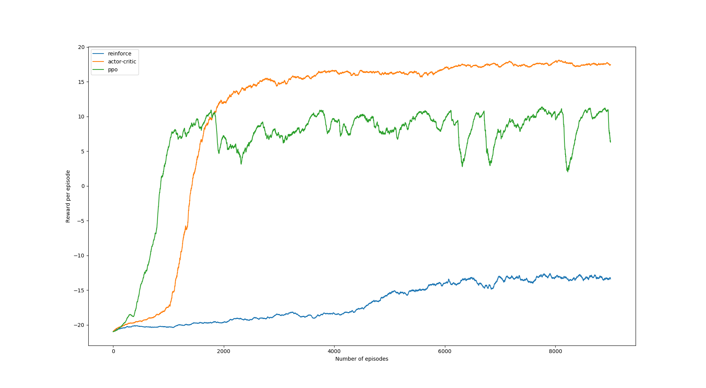

# pytorch-baselines

Running the implemented agents on pong gives the following results:

#### Notes to self:
Limiting the number of threads in pytorch: OMP_NUM_THREADS
Great tool for profiling python line by line: https://github.com/rkern/line_profiler

